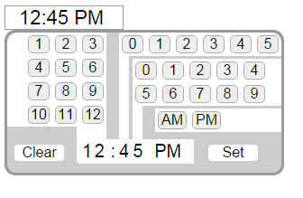

# TimePicker



The goal of this project was to create a JavaScript timepicker that is as simple as possible to install on any web page.

I also wanted to make it possible for the user to pick any number of minutes quickly without having to perform multiple clicks on the same button.  This is so that the TimePicker could be used for things like recording data, not just scheduling events.

JQuery is not used so that the TimePicker can be used in places where jQuery is being avoided.

The files work on XAMPP.  (I don't have anywhere else to test them.)

#### Current Limitations
 * TimePicker is not responsive and not workable for mobile devices 
 
#### Files Required to Make the TimePicker Work:
 * TimePicker.css
 * TimePicker.js
 * TimePicker.php

#### Other Files that Might Be Helpful to Look At:
 * installedTimePicker.php  - demonstrates how to set up the TimePicker on a web page
 * inputUseTest.php - file from testing to make sure that the input from the TimePicker is actually useable

### How to Install the TimePicker:
1. In the directory that contains the web page that will contain the TimePicker, create a directory named "TimePicker" and put in it the following files:

   * TimePicker.css
   * TimePicker.js
   * TimePicker.php

2. Add this line to the `<head>` section of the web page that is to have the TimePicker installed on it:

   ```
   <link href="TimePicker/TimePicker.css" rel="stylesheet">
   ```
3. Put these two lines on the web page in the place where you want the TimePicker to be:

   ```
   <div class="timeBox"></div>  
   <?php include('TimePicker/TimePicker.php'); ?>
   ```
4. Before '</body>', add this line:

   ```
   <script src="TimePicker/TimePicker.js"></script>
   ```
5. If the web page containing the newly installed TimePicker is a '.html' file, change the file extension to '.php' instead.
  