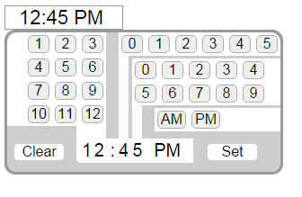

# TimePicker



The goal of this project was to create a JavaScript timepicker that is as simple as possible to install on any web page.

I also wanted to make it possible for the user to pick any number of minutes quickly without having to perform multiple clicks on the same button.  This is so that the TimePicker could be used for things like recording data, not just scheduling events.

JQuery is not used so that the TimePicker can be used in places where jQuery is being avoided.

The filess work on XAMPP.  (I don't have anywhere else to test them.)

#### Current Limitations
 * TimePicker does not work properly if more than one is placed on the same page
 * TimePicker is not responsive and not workable for mobile devices 
 
#### Files Required to Make the TimePicker Work:
 * TimePicker.css
 * TimePicker.js
 * TimePicker.php

#### Other Files that Might Be Helpful to Look At:
 * TimePickerDemo.php  - demonstrates how to set up the TimePicker on a web page
 * inputUseTest.php - file from testing to make sure that the input from the TimePicker is actually useable

### How to Install the TimePicker:
1. In the directory that contains the web page that will use the TimePicker, create a directory named "TimePicker" and put the three required files listed above in it.
2. Add these two lines to the `<head>` section of the web page:
```
<link href="TimePicker/TimePicker.css" rel="stylesheet">
<script src="TimePicker/TimePicker.js"></script>
```
3. Put these two lines on the web page in the place where you want the TimePicker to be:
```
<div  id="timeBox" class="timeBox" onClick="displayPicker()"></div>  
<?php include('TimePicker/TimePicker.php'); ?>
```